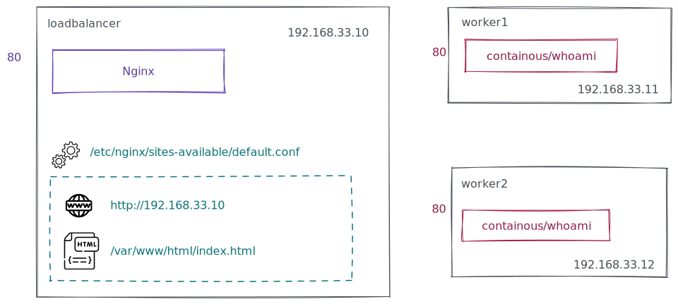
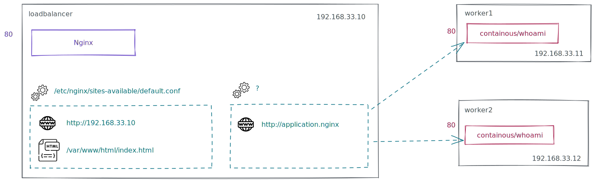

# Ansible Nginx rollout

Welcome to this playground to install [Nginx](https://www.nginx.com/) and configure routing to an application using [Ansible](https://docs.ansible.com/ansible/latest/index.html).

This playground provide a setup for 3 VM using [Vagrant](https://www.vagrantup.com/), one for nginx to be used as loadbalancer and 2 for application deployment.

This repository already define a playbook with :
 - Nginx installed
 - Application installation and startup
 - A default site enabled on Nginx on domain (192.168.33.10)

Here is a schema of what is provided :




## Installation

Install the provided architecture by running :
```bash
> vagrant up
...

> ansible-playbook main.yaml
...
```

If everything worked without an error you should be able to connect to :
 - Load balancer : http://192.168.33.10/
 - Worker1 : http://192.168.33.11/
 - Worker2 : http://192.168.33.12/

Nginx is configured to respond with a default site when you call it with the domain `192.168.33.10`, look at how the configuration is done using [Ansible task](roles/nginx/tasks/main.yaml).

### _Optional_

You can add `application.nginx 192.168.33.10` to your `/etc/hosts` to be able to request the application.nginx domain from your host browser.  
If you don't add this configruation you can specify the domain by adding a `Host` header in your http request tool (example using curl: `curl -H "Host: example.com" http://localhost/`)


## Instructions

After the installation you now have a 3 VM running system with Nginx ready to serve request.  
Now it's time to add the application to be served under the domain name `application.nginx`, we need to add another site in the nginx configuration to respond to the domain `application.nginx` and to send the request to on of the worker randomly.

To help you here are the Nginx configuration part to send requeston 2 server that are missing from the already existing configuration in the playground:
```
upstream application {
    server <ip worker1>;
    server <ip worker2>;
}

server {
    ...
    location / {
        proxy_pass http://application;
   }
}
```

Goal :  


Explore the existing configuration to find how to create the missing tasks in [app/routing](roles/app/routing) role and configure it in [main playbook](main.yaml) 

*Have fun !*